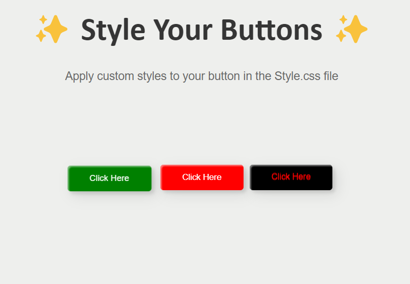

# [SDF04] CSS Magic Buttons

## Learning Outcomes

- Design engaging button animations with CSS.
- Master the use of CSS transitions and animations for interactive effects.

## Project Outlines
 - The design choice was inpired by codespace curated buttons via codepen https://codepen.io/codespace-academy/pen/xxmWrjX.

 - It was a good challenge, I had to learn about CSS transitions and animations to make the buttons to have interactive effects.
 The CSS: Cascading Style Sheets - MDN Web Docs were insightful and easy to follow as guide to make use of transitions and animations.

 - First and foremost I had to familiarise myself with the CSS terms like position, display, box-shadow, margin, keyframes, animations, transform and etc.

 # First button:
 I wanted to an animation with the pulse rate or delay to grab a user's attention. 
 I came arcoss @keyframes pulse which is a CSS at-rule used to define the behavior of an animation. It is defining a pulse animation, which typically involves a button expanding and contracting in a continuous loop, creating a pulsating effect.
 
 I had to learn about display, margin, and postion since I wanted the three buttons to be horizontal instead of vertical.
 In this case I used display: inline block to be move it to the beginning of the newline and used margain to place or postion it to be in close proximity with other buttons hortizontal.

# Second button
I used keyframes rotate to rotate the button continuously in a clockwise direction, completing one full rotation every 30 seconds, with a constant speed throughout.

# Third button
I used hover and transform that when the button is hovered over to make a transformation to move the along the horizontal axis by 10 pixels to the right.
Used bottom to vertically position to move up to be inline with the first button horizontal and text shadow to enable shows effects to be applied to the text

# Struggles
I had to familiarise myself with all the propertries used in the CSS code to be able to declare the right property for my goal which took a bit of time to complete the project but end up having fun making interactive buttons

